# Beat-Blast
> 在一個被魔法所籠罩的奇幻世界裡，精靈們能夠控制元素的力量，也因此過著安逸的生活，然而，精靈們並不滿足，想要獲得更強大的力量，而森林中有個洞窟裡有許多能量礦石，礦石的能量脈動能夠增強元素的力量，傳說中洞窟的最深處有著各種礦石融合成的賢者之石，能夠產生最純粹的脈動……

## 遊戲內容

### 遊戲整體設計概念
在這個遊戲中，玩家是一隻精靈，需要在洞窟中一邊擊退阻撓你的石系魔物一邊前進，遊戲過程中，如果配合背景音樂的拍點進行攻擊可以強化攻擊的效果，最後通過魔王關就可以取得賢者之石，結束遊戲。

### 玩家與遊戲的互動
- 玩家：移勪、攻擊怪物、操作地圖上的機關、使用道具
- 怪物：移動、攻擊玩家

## 遊戲功能

### 遊戲階段流程圖

## 遊戲物件

### 角色
精靈，擁有血量、魔力值、擁有的元素力量、對應到拍點的combo數增益等數值，可以根據持有的元素力量的種類對怪物發起各種攻擊。

### 怪物
各種魔物，擁有血量、攻擊方式、移動方式等各種數值。

### 道具
打倒魔物時機率掉落道具，有各種效果增益，血量、攻擊、移速等，或獲得消耗性技能，經過一段時間後結束。

### 場景
在洞窟中分布著裸露的礦石，礦石會跟隨著音樂發出脈動，精靈只要在持有元素力量對應種類的礦石脈動時攻擊便可累積combo數，獲得多階段的攻擊強化。在礦石中還會有純度較高的晶礦，接觸到晶礦的脈動會改變精靈持有的力量種類，進而更改外表與攻擊機制或其他相關數值。

## 概念圖

